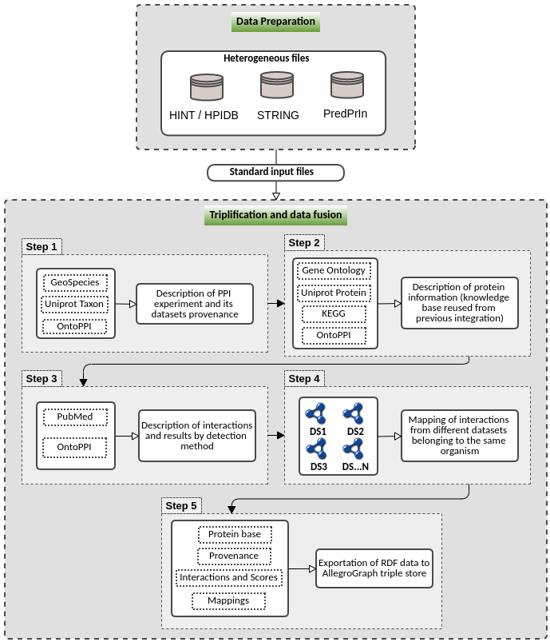

# PPIntegrator - PPI Triplification Process

Python pipelines to prepare PPI (Protein-Protein  Interactions) data from reference databases and describe them semantically using ontologies

## Summary

This pipeline has as major goal provide a tool for protein interactions (PPI) prediction data formalization and standardization using the [OntoPPI](https://link.springer.com/chapter/10.1007/978-3-030-36599-8_23) ontology. This pipeline is splitted in two parts: (i) a part to prepare data from three main sources of PPI data ([HINT](http://hint.yulab.org/), [STRING](https://string-db.org/) and [PredPrin](https://github.com/YasCoMa/PredPrin.git)) and create the standard files to be processed by the next part; (ii) the second part uses the data prepared before to semantically describe using ontologies related to the concepts of this domain. It describes the provenance information of PPI prediction experiments, datasets characteristics, functional annotations of proteins involved in the PPIs, description of the PPI detection methods (also named as evidence) used in the experiment,  and the prediction score obtained by each PPI detection method for the PPIs. This pipeline also execute data fusion to map the same protein pairs from different data sources and, finally, it creates a database of all these information in the [alegro](https://allegrograph.com/) graph triplestore. The figure below illustrates the two parts of this pipeline.

<div style="text-align: center">
	
</div>

## Requirements:
* Python packages needed:
	- pip3 install numpy
	- pip3 install rdflib
	- pip3 install uuid
	- pip3 install SPARQLWrapper
	- alegro graph tools (pip3 install agraph-python) <br > 
		Go to this [site](https://franz.com/agraph/support/documentation/current/python/install.html) for the installation tutorial

## Usage Instructions
### Preparation:
1. ````git clone https://github.com/YasCoMa/ppintegrator.git````
2. ````cd ppintegrator````
3. `pip3 install -r requirements.txt`
**Allegrograph is a triple store, which is a database to maintain semantic descriptions. This database's server provides a web application with a user interface to run, edit and manage queries, visualize results and manipulate the data without writing codes other than SPARQL query language. The use of the Allegregraph option is not mandatory, but if you want to export and use it, you have to install the server and the client.**
4. if you want to use the Allegrograph server option (this triple store has free license up to 5,000,000 triples), install allegrograph server in your machine (configure a user and password): Server - https://franz.com/agraph/support/documentation/current/server-installation.html; Client - https://franz.com/agraph/support/documentation/current/python/install.html
5. Export the following environment variables to configure Allegrograph server

````
export AGRAPH_HOST=127.0.0.1
export AGRAPH_PORT=10035
export AGRAPH_USER=chosen_user
export AGRAPH_PASSWORD=chosen_password
````
5. Start allegrograph: ````path/to/allegrograph/bin/agraph-control --config path/to/allegrograph/lib/agraph.cfg start````
6. Read the file data_requirements.txt to understand which files are needed for the process

### Data preparation (first part) - File ````prepare_data_triplification.py```` :
* Pipeline parameters:
	- __-rt__ or __--running_type__ <br>
		Use to indicate from which source you want to prepare PPI data, as follows: <br>
		1 - Prepare data for PredPrin <br>
		2 - Prepare data for String <br>
		3 - Prepare data for HINT
	- __-fec__ or __--file_experiment_config__ <br>
		File with the experiment configuration in json format<br>
		
		Examples are in these files (all the metadata are required): params_hint.json, params_predrep_5k.json e params_string.json

	- __-org__ or __--organism__ <br>
		Prepare data only for one organism of interest (example: homo_sapiens) <br >

		This parameter is optional. If you do not specify, it will automatically use the organisms described in the experiment configuration file above


* Running modes examples:
	1. Running for PPI data generated by PredPrin: <br>
	````python3 prepare_data_triplification.py -rt 1 -fec params_predrep_5k.json````

	2. Running for HINT database: <br>
	````python3 prepare_data_triplification.py -rt 3 -fec params_hint.json````

	3. Running for STRING database: <br>
	````python3 prepare_data_triplification.py -rt 2 -fec params_string.json````

	In the file ````auxiliar_data_preparation.py```` you can run it for all the examples provided automatically, as follows: <br>
	````python3 auxiliar_data_preparation.py````


### PPI data triplification (second part) - File ````triplification_ppi_data.py````:

* Pipeline parameters:
	- __-rt__ or __--running_type__ <br>
		Use to indicate which execution step you want to run (it is desirable following the order showed): <br>
		0 - Generate the descriptions for all the protein interaction steps of an experiment  (run steps 1, 2 and 3) <br >
		1 - Generate triples just about data provenance <br >
		2 - Generate triples just for protein functional annotations<br >
		3 - Generate triples just for the score results of each evidence<br >
		4 - Execute data fusion<br >
		5 - Generate descriptions and execute data fusion (run steps 1, 2, 3 and 4)<br >
		6 - Export to allegrograph server

	- __-fec__ or __--file_experiment_config__ <br>
		File with the experiment configuration in json format<br>
		
		Examples are in these files (all the metadata are required): params_hint.json, params_predrep_5k.json e params_string.json

	- __-fev__ or __--file_evidence_info__ <br>
		File with the PPI detection methods information in json format<br>
		
		Examples are in these files (all the metadata are required): evidences_information.json, evidences_information_hint.json e evidences_information_string.json

	- __-fcv__ or __--file_config_evidence__ <br>
		File with the experiment and evidence methods files addresses in tsv format<br>
		
		Example of this file: config_evidence_file.tsv

* Running modes examples:
	1. Running to generate all semantic descriptions for PredPrin: <br>
	````python3 triplification_ppi_data.py -rt 0 -fec params_predrep_5k.json -fev evidences_information.json````

	2. Running to generate only triples of data provenance: <br>
	````python3 triplification_ppi_data.py -rt 1 -fec params_hint.json -fev evidences_information_hint.json````

	3. Running to generate only triples of PPI scores for each evidence: <br>
	````python3 triplification_ppi_data.py -rt 3 -fec params_hint.json -fev evidences_information_hint.json````

	4. Running to generate only triples of protein functional annotations (only PredPrin exports these annotations): <br>
	````python3 triplification_ppi_data.py -rt 2 -fec params_predrep_5k.json -fev evidences_information.json````

	5. Running to generate all semantic descrptions for STRING: <br>
	````python3 triplification_ppi_data.py -rt 0 -fec params_string.json -fev evidences_information_string.json````
    
    **For the next options (4, 5 and 6), it is mandatory running at least mode 1 and 3 for HINT, STRING and PredPrin**
    
	6. Running to execute data fusion of different sources: <br>
	````python3 triplification_ppi_data.py -rt 4 -fcv config_evidence_file.tsv````

	7. Running to generate all semantic descriptions and execute data fusion of different sources (combines mode 0 and 4): <br>
	````python3 triplification_ppi_data.py -rt 5 -fcv config_evidence_file.tsv````

	8.  Export semantic data to allegrograph server: <br>
	````python3 triplification_ppi_data.py -rt 6 -fcv config_evidence_file.tsv````

## Query Scenarios for analysis
Supposing you ran all the steps showed in the section above, you can run the following options to analyse the data stored alegro graph triple store. <br>
File to use for this section: ````query_analysis_ppitriplificator.py```` <br>

* Parameter:
	- __-q__ or __--query_option__ <br>
		Use to indicate which query you want to perform: <br>
		1 - Get all the different organisms whose interactions are stored in the database<br >
		2 - Get the interactions that have scientific papers associated and the list of these papers<br >
		3 - Get a list of the most frequent biological processes annotated for the interactions of Escherichia coli bacteria<br >
		4 - Get only the interactions belonging to a specific biological process (regulation of transcription, DNA-templated) in Escherichia coli bacteria<br >
		5 - Get the scores of interactions belonging to a specific biological process (regulation of transcription, DNA-templated) in Escherichia coli bacteria<br >
		6 - Get a list of the most frequent biological processes annotated for the interactions of human organism<br >
		7 - Get only the interactions belonging to a specific biological process (positive regulation of transcription by RNA polymerase II) in human organism<br >
		8 - Get the scores of interactions belonging to a specific biological process (positive regulation of transcription by RNA polymerase II) in human organism

* Running modes examples:
	1. Running queries: <br>
	````python3 query_analysis_ppitriplificator.py -q 1 ```` <br>
		Change number 1 to the respective number of the query you want to perform

## Reference
Martins, Y. C., Ziviani, A., Cerqueira e Costa, M. D. O., Cavalcanti, M. C. R., Nicolás, M. F., & de Vasconcelos, A. T. R. (2023). PPIntegrator: semantic integrative system for protein–protein interaction and application for host–pathogen datasets. Bioinformatics Advances, 3(1), vbad067.

## Bug Report
Please, use the [Issues](https://github.com/YasCoMa/ppintegrator/issues) tab to report any bug.
